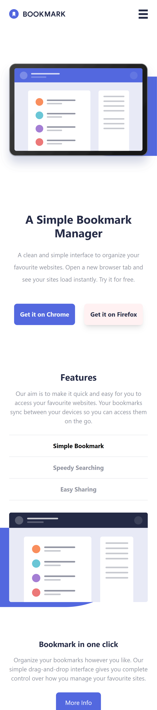
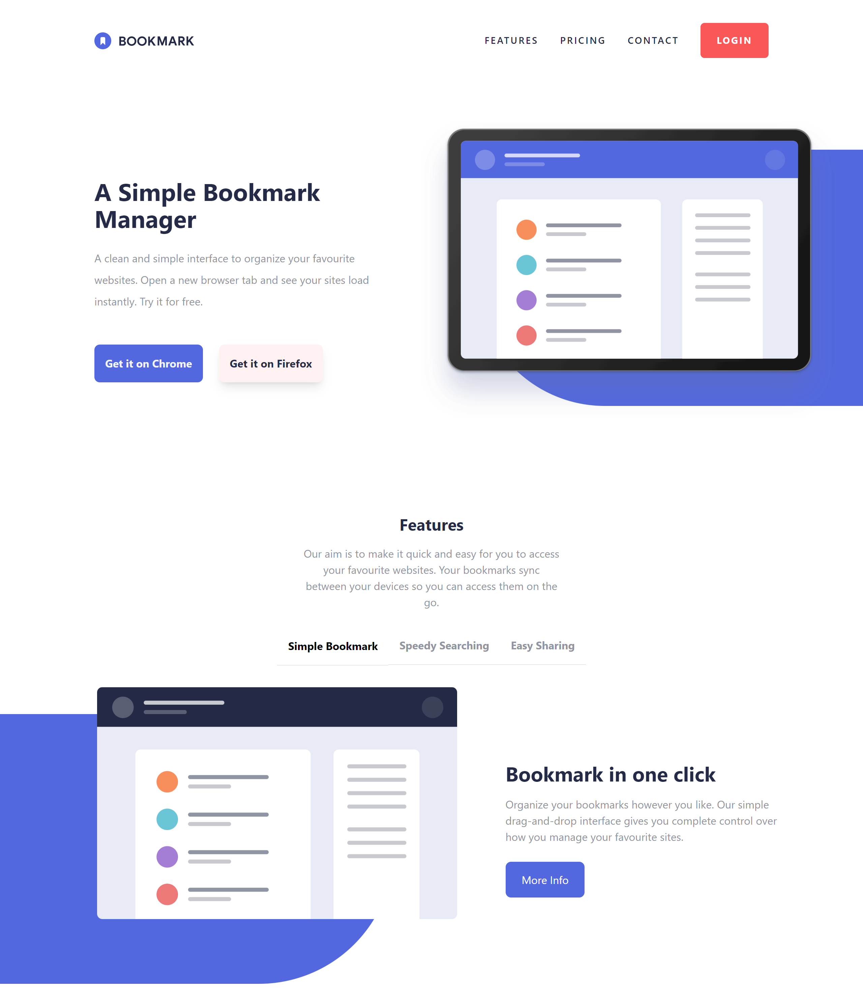

# Frontend Mentor - Bookmark landing page solution

This is a solution to the [Bookmark landing page challenge on Frontend Mentor](https://www.frontendmentor.io/challenges/bookmark-landing-page-5d0b588a9edda32581d29158). Frontend Mentor challenges help you improve your coding skills by building realistic projects. 

## Table of contents

- [Frontend Mentor - Bookmark landing page solution](#frontend-mentor---bookmark-landing-page-solution)
  - [Table of contents](#table-of-contents)
  - [Overview](#overview)
    - [The challenge](#the-challenge)
    - [Screenshot](#screenshot)
      - [Mobile Screen](#mobile-screen)
      - [Mobile Screen with expanded navigation menu](#mobile-screen-with-expanded-navigation-menu)
      - [Desktop screen](#desktop-screen)
    - [Links](#links)
  - [My process](#my-process)
    - [Built with](#built-with)
    - [What I learned](#what-i-learned)
    - [Continued development](#continued-development)
    - [Useful resources](#useful-resources)
  - [Author](#author)

**Note: Delete this note and update the table of contents based on what sections you keep.**

## Overview

### The challenge

Users should be able to:

- View the optimal layout for the site depending on their device's screen size
- See hover states for all interactive elements on the page
- Receive an error message when the newsletter form is submitted if:
  - The input field is empty
  - The email address is not formatted correctly

### Screenshot

#### Mobile Screen

#### Mobile Screen with expanded navigation menu

#### Desktop screen

### Links

- Solution URL: [Github Repo](https://github.com/mighty-odewumi/bookmark-landing-page)
- Live Site URL: [Bookmark Landing Page](https://bookmark-landing-page-mighty-odewumi.vercel.app)

## My process

### Built with

- Semantic HTML5 markup
- CSS custom properties
- Flexbox
- CSS Grid
- Mobile-first workflow
- [React](https://reactjs.org/) - JS library
- TailwindCSS

### What I learned

I was able to learn to use Tailwind custom class utilities to design the user interface.

### Continued development

One area I think I would like to explore is the use of Tailwind for dark mode functionalities.

### Useful resources

- [Tailwind Official Docs](https://tailwind.org) - Going through the docs helped me explore a lot of options I didn't know I have when implementing a design or when I needed to use a class utility and didn't know the correct syntax.

## Author

- Website - [Github](https://github.com/mighty-odewumi)
- Frontend Mentor - [@mighty-odewumi](https://www.frontendmentor.io/profile/mighty-odewumi)
- Twitter - [@da_gr1ntch](https://www.twitter.com/da_gr1ntch)

